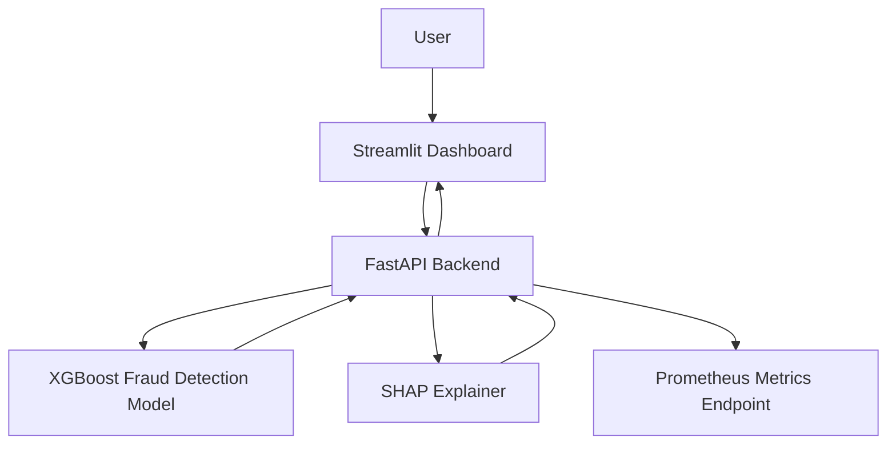
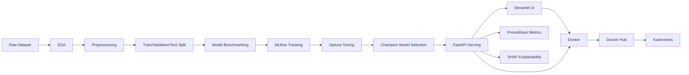
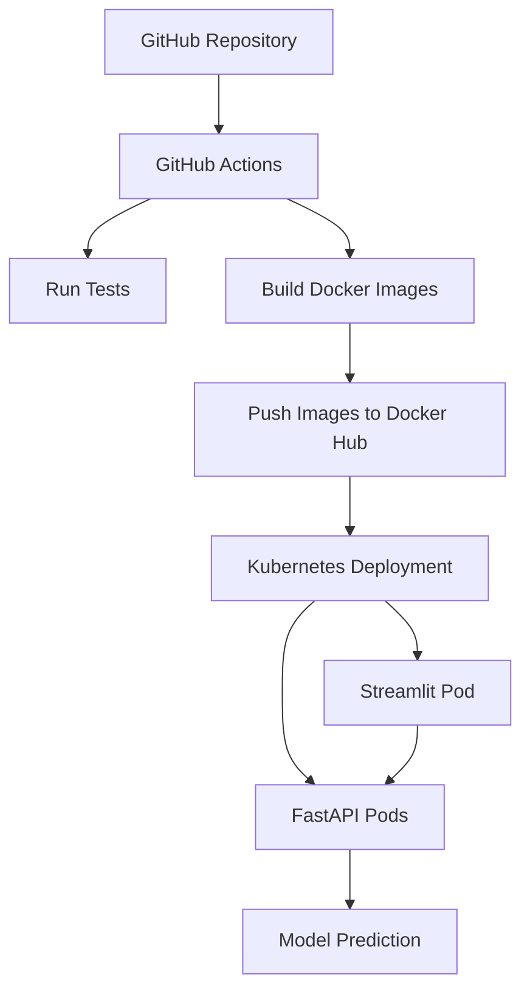
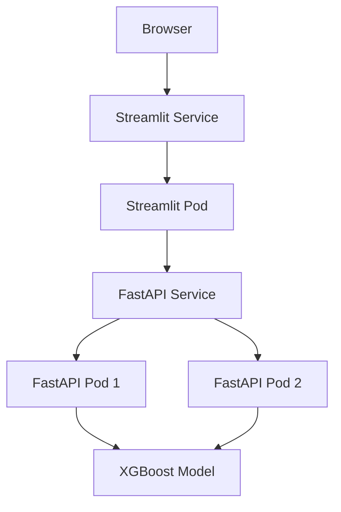

# Credit Card Fraud Detection MLOps System

A production-grade machine learning system for detecting fraudulent credit card transactions using a tuned XGBoost classifier, FastAPI model serving, Streamlit dashboard, Docker, Kubernetes, MLflow experiment tracking, Optuna hyperparameter tuning, Prometheus monitoring, SHAP explainability, and GitHub Actions CI/CD.

---

## Table of Contents

1. [Project Overview](#project-overview)
2. [Problem Statement](#problem-statement)
3. [Why Fraud Detection?](#why-fraud-detection)
4. [Dataset](#dataset)
5. [Project Goals](#project-goals)
6. [End-to-End Architecture](#end-to-end-architecture)
7. [Tech Stack](#tech-stack)
8. [Repository Structure](#repository-structure)
9. [Machine Learning Workflow](#machine-learning-workflow)
10. [Exploratory Data Analysis](#exploratory-data-analysis)
11. [Preprocessing Pipeline](#preprocessing-pipeline)
12. [Model Benchmarking](#model-benchmarking)
13. [Hyperparameter Tuning](#hyperparameter-tuning)
14. [Final Model Selection](#final-model-selection)
15. [Model Explainability](#model-explainability)
16. [FastAPI Backend](#fastapi-backend)
17. [Streamlit Frontend](#streamlit-frontend)
18. [Prometheus Monitoring](#prometheus-monitoring)
19. [Docker Setup](#docker-setup)
20. [Docker Compose Setup](#docker-compose-setup)
21. [Kubernetes Deployment](#kubernetes-deployment)
22. [GitHub Actions CI/CD](#github-actions-cicd)
23. [How to Run Locally](#how-to-run-locally)
24. [How to Run with Docker Compose](#how-to-run-with-docker-compose)
25. [How to Run on Kubernetes](#how-to-run-on-kubernetes)
26. [API Documentation](#api-documentation)
27. [Testing](#testing)
28. [Results](#results)
29. [Screenshots](#screenshots)
30. [Future Improvements](#future-improvements)
31. [Resume Highlights](#resume-highlights)

---

## Project Overview

This project implements an end-to-end credit card fraud detection system. It begins with exploratory data analysis and model experimentation, then moves into a complete MLOps workflow involving model tracking, model tuning, serving, containerization, dashboarding, monitoring, explainability, and Kubernetes deployment.

The system is designed to simulate a real-world fraud detection platform where transactions can be scored through an API or through a user-friendly dashboard.

The final system includes:

* Machine learning model training and benchmarking
* Imbalanced classification handling
* MLflow experiment tracking
* Optuna hyperparameter tuning
* Tuned XGBoost fraud detection model
* FastAPI backend for model serving
* Streamlit frontend for interactive usage
* SHAP-based transaction-level explanations
* Prometheus-compatible metrics endpoint
* Docker and Docker Compose support
* Kubernetes deployment
* GitHub Actions CI/CD
* Docker Hub image publishing

---

## Problem Statement

Credit card fraud detection is a highly imbalanced binary classification problem. The goal is to identify fraudulent transactions while minimizing false alarms on legitimate users.

A fraud detection model must balance two competing objectives:

1. Detect as many fraudulent transactions as possible.
2. Avoid incorrectly flagging genuine transactions as fraud.

False negatives are costly because they allow fraud to pass undetected. False positives are also costly because they may block genuine customers and reduce trust in the payment system.

This project builds a machine learning system that predicts whether a transaction is fraudulent and exposes the prediction through production-style APIs and interfaces.

---

## Why Fraud Detection?

Fraud detection is an excellent real-world machine learning problem because it involves:

* Severe class imbalance
* High business impact
* Precision-recall tradeoffs
* Cost-sensitive decision making
* Need for explainability
* Real-time prediction requirements
* Monitoring and production reliability concerns

Unlike simple classification problems, fraud detection requires careful evaluation beyond accuracy. Metrics such as PR-AUC, recall, precision, F1-score, false positives, false negatives, and business cost are more meaningful.

---

## Dataset

This project uses the popular credit card fraud detection dataset containing anonymized credit card transactions.

### Dataset Characteristics

The dataset contains:

* `Time`: Seconds elapsed between each transaction and the first transaction
* `V1` to `V28`: PCA-transformed anonymized transaction features
* `Amount`: Transaction amount
* `Class`: Target variable

  * `0`: Legitimate transaction
  * `1`: Fraudulent transaction

### Important Dataset Properties

* Highly imbalanced binary classification dataset
* Fraud transactions are a very small fraction of total transactions
* Most features are anonymized PCA components
* The `Amount` and `Time` features require scaling
* Accuracy is not a useful primary metric because of imbalance

---

## Project Goals

The main goals of this project are:

1. Build a strong fraud detection model.
2. Compare many machine learning algorithms.
3. Handle class imbalance properly.
4. Track experiments using MLflow.
5. Tune top models using Optuna.
6. Select a production-focused final model.
7. Serve the model using FastAPI.
8. Build an interactive Streamlit UI.
9. Add SHAP explanations for interpretability.
10. Add Prometheus metrics for monitoring.
11. Containerize the backend and frontend.
12. Deploy the system on Kubernetes.
13. Automate testing and Docker image publishing using GitHub Actions.

---

## End-to-End Architecture

### High-Level System Architecture



### MLOps Architecture



### Deployment Architecture



---

## Tech Stack

### Machine Learning

* Python
* Pandas
* NumPy
* Scikit-learn
* XGBoost
* LightGBM
* Imbalanced-learn
* Optuna
* SHAP

### Experiment Tracking

* MLflow
* SQLite backend store for MLflow

### Backend

* FastAPI
* Uvicorn
* Pydantic

### Frontend

* Streamlit
* Requests
* Pandas

### Monitoring

* Prometheus client
* Prometheus FastAPI Instrumentator

### DevOps and MLOps

* Docker
* Docker Compose
* Kubernetes
* Docker Hub
* GitHub Actions

### Testing

* Pytest
* FastAPI TestClient
* HTTPX

---

## Repository Structure

```text
fraud-detection-mlops/
│
├── app/
│   └── main.py
│
├── data/
│   ├── raw/
│   │   └── creditcard.csv
│   └── processed/
│       ├── X_train.csv
│       ├── X_valid.csv
│       ├── X_test.csv
│       ├── y_train.csv
│       ├── y_valid.csv
│       └── y_test.csv
│
├── frontend/
│   └── streamlit_app.py
│
├── k8s/
│   ├── namespace.yaml
│   ├── deployment.yaml
│   ├── service.yaml
│   ├── streamlit-deployment.yaml
│   ├── streamlit-service.yaml
│   └── hpa.yaml
│
├── models/
│   ├── tuned_xgboost_weighted.pkl
│   └── scaler.pkl
│
├── monitoring/
│
├── notebooks/
│   ├── 01_eda.ipynb
│   └── 07_error_analysis.ipynb
│
├── reports/
│   ├── figures/
│   ├── full_model_zoo_results.csv
│   ├── xgboost_champion_config.json
│   └── xgboost_champion_test_metrics.json
│
├── src/
│   ├── load_data.py
│   ├── preprocessing.py
│   ├── check_processed_data.py
│   ├── mlflow_config.py
│   ├── train_full_model_zoo.py
│   ├── tune_top_models.py
│   ├── finalize_xgboost_champion.py
│   └── register_xgboost_champion.py
│
├── tests/
│   ├── fixtures/
│   │   ├── X_test_sample.csv
│   │   └── y_test_sample.csv
│   └── test_api.py
│
├── .github/
│   └── workflows/
│       ├── ci.yml
│       └── docker-publish.yml
│
├── Dockerfile
├── Dockerfile.streamlit
├── docker-compose.yml
├── requirements.txt
├── pytest.ini
├── .dockerignore
├── .gitignore
└── README.md
```

---

## Machine Learning Workflow

The machine learning workflow follows these steps:

1. Load raw dataset.
2. Perform exploratory data analysis.
3. Check missing values and duplicates.
4. Analyze class imbalance.
5. Engineer time-based features.
6. Split data into train, validation, and test sets.
7. Scale selected numerical columns.
8. Train a broad model zoo.
9. Track all experiments with MLflow.
10. Tune top models with Optuna.
11. Select final champion model.
12. Evaluate on untouched test set.
13. Save model and configuration.
14. Serve model through FastAPI.
15. Add explainability and monitoring.

---

## Exploratory Data Analysis

The EDA phase includes:

* Class distribution analysis
* Missing value check
* Duplicate transaction check
* Transaction amount distribution
* Log-transformed amount distribution
* Time-based transaction pattern analysis
* PCA feature distribution comparison
* Feature correlation analysis
* Fraud vs non-fraud behavior comparison

Key observations:

* The dataset is highly imbalanced.
* Fraud transactions are rare compared to legitimate transactions.
* Accuracy is misleading due to class imbalance.
* Precision-recall based metrics are more appropriate.
* Some PCA-transformed features show visible differences between fraud and non-fraud transactions.

---

## Preprocessing Pipeline

The preprocessing pipeline performs:

1. Feature engineering:

   * `Hour` from `Time`
   * `Day` from `Time`

2. Stratified splitting:

   * Training set
   * Validation set
   * Test set

3. Scaling:

   * `Time`
   * `Amount`
   * `Hour`
   * `Day`

4. Saving artifacts:

   * Processed datasets
   * Fitted scaler

The model expects exactly 32 processed features:

```text
Time, V1, V2, ..., V28, Amount, Hour, Day
```

Raw Kaggle rows contain only 30 features:

```text
Time, V1, V2, ..., V28, Amount
```

The Streamlit UI can accept raw 30-feature input and automatically create `Hour`, `Day`, and scale the appropriate columns.

---

## Model Benchmarking

A large model zoo was benchmarked to compare different families of machine learning algorithms.

Model families included:

* Dummy baseline
* Logistic Regression
* Ridge Classifier
* SGD Classifier
* Passive Aggressive Classifier
* Perceptron
* Linear SVM
* Naive Bayes
* LDA
* QDA
* KNN
* Decision Tree
* Extra Tree
* Random Forest
* Extra Trees
* Bagging
* AdaBoost
* Gradient Boosting
* Histogram Gradient Boosting
* XGBoost
* LightGBM
* Balanced Random Forest
* Easy Ensemble
* RUSBoost
* MLP Classifier
* Isolation Forest
* Local Outlier Factor
* One-Class SVM
* SMOTE pipelines
* Random undersampling pipelines
* SMOTETomek pipelines

Evaluation metrics included:

* PR-AUC
* ROC-AUC
* Precision
* Recall
* F1-score
* False positives
* False negatives
* Business cost

The simulated business cost was defined as:

```text
Business Cost = False Negatives × 5000 + False Positives × 100
```

This reflects the idea that missing fraud is usually much more expensive than incorrectly flagging a legitimate transaction.

---

## Hyperparameter Tuning

The top models from benchmarking were tuned using Optuna.

Tuned models included:

* Weighted XGBoost
* Balanced LightGBM
* SMOTE LightGBM
* Balanced Extra Trees

Optuna optimized PR-AUC on the validation set.

For each tuned model, the workflow logged:

* Trial number
* Hyperparameters
* PR-AUC
* ROC-AUC
* Precision
* Recall
* F1-score
* Best F1 threshold
* Cost-optimized threshold
* False positives
* False negatives
* Business cost
* MLflow run ID

All tuning experiments were tracked in MLflow.

---

## Final Model Selection

The final model selected for production was:

```text
Weighted XGBoost
```

The model was selected because it provided a strong balance between fraud detection performance and customer experience.

Although some models achieved slightly higher PR-AUC, weighted XGBoost produced fewer false positives while maintaining strong recall and F1-score.

This matters because in fraud detection:

* False negatives allow fraud to go undetected.
* False positives can block legitimate users.
* A production system must balance fraud prevention with customer friction.

### Validation Performance Summary

| Model                | PR-AUC | Best F1 | False Positives at Cost Threshold | False Negatives at Cost Threshold | Business Cost |
| -------------------- | -----: | ------: | --------------------------------: | --------------------------------: | ------------: |
| LightGBM Balanced    |  0.856 |   0.867 |                                41 |                                13 |        69,100 |
| XGBoost Weighted     |  0.849 |   0.851 |                                11 |                                14 |        71,100 |
| SMOTE LightGBM       |  0.848 |   0.865 |                                25 |                                12 |        62,500 |
| Extra Trees Balanced |  0.823 |   0.855 |                                64 |                                11 |        61,400 |

The final production-focused choice was weighted XGBoost because it strongly reduced false positives while maintaining competitive fraud detection performance.

---

## Model Explainability

SHAP explainability was added to make individual fraud predictions interpretable.

The `/explain` endpoint returns:

* Fraud probability
* Prediction class
* Risk level
* Decision threshold
* Base value
* Top contributing features
* SHAP value for each important feature
* Whether the feature increased or decreased fraud risk

This is useful because fraud detection models often require explainability for:

* Analyst review
* Business trust
* Debugging predictions
* Understanding model behavior
* Regulatory or audit-style review

---

## FastAPI Backend

The FastAPI backend serves the trained model.

### Main Responsibilities

* Load tuned XGBoost model
* Load champion model configuration
* Validate feature length
* Return fraud predictions
* Return batch predictions
* Return model metadata
* Return SHAP explanations
* Expose Prometheus metrics

### Endpoints

| Method | Endpoint         | Description                                 |
| ------ | ---------------- | ------------------------------------------- |
| GET    | `/`              | Root endpoint                               |
| GET    | `/health`        | Health check endpoint                       |
| GET    | `/model-info`    | Model metadata and configuration            |
| POST   | `/predict`       | Predict single transaction                  |
| POST   | `/predict-batch` | Predict multiple transactions               |
| POST   | `/explain`       | Explain a transaction prediction using SHAP |
| GET    | `/metrics`       | Prometheus metrics endpoint                 |

---

## Streamlit Frontend

The Streamlit dashboard provides an interactive interface for using the fraud detection model.

### Features

* Connects to FastAPI backend
* Supports single transaction prediction
* Supports batch CSV prediction
* Supports raw Kaggle 30-feature input
* Supports processed 32-feature input
* Can load local processed test samples
* Displays prediction result cards
* Displays fraud probability
* Displays risk level
* Supports model info viewing
* Supports monitoring endpoint checks
* Supports SHAP explainability visualization

### Streamlit Tabs

1. Single Prediction
2. Batch Prediction
3. Model Info
4. Monitoring
5. Explainability

---

## Prometheus Monitoring

The FastAPI backend exposes Prometheus-compatible metrics at:

```text
/metrics
```

Custom metrics include:

```text
fraud_predictions_total
fraud_flags_total
fraud_prediction_probability
```

These metrics can be used to monitor:

* Number of prediction requests
* Number of transactions flagged as fraud
* Distribution of fraud probabilities
* Model confidence behavior
* API request behavior

Prometheus annotations are also added to the Kubernetes FastAPI deployment.

---

## Docker Setup

The project contains two Dockerfiles:

```text
Dockerfile
Dockerfile.streamlit
```

### FastAPI Docker Image

The FastAPI Docker image contains:

* FastAPI app
* Trained XGBoost model
* Model configuration
* Required Python dependencies

### Streamlit Docker Image

The Streamlit Docker image contains:

* Streamlit frontend
* Scaler artifact
* Processed test dataset or test fixtures
* Required Python dependencies

---

## Docker Compose Setup

Docker Compose runs both services locally.

### Services

```text
fraud-api
fraud-streamlit-ui
```

### Architecture

```text
Streamlit container → FastAPI container → XGBoost model
```

Inside Docker Compose, Streamlit connects to FastAPI using the internal service name:

```text
http://fraud-api:8000
```

The browser accesses the services using:

```text
http://localhost:8000
http://localhost:8501
```

---

## Kubernetes Deployment

The project includes Kubernetes manifests for deploying both FastAPI and Streamlit.

### Kubernetes Resources

```text
Namespace
FastAPI Deployment
FastAPI Service
Streamlit Deployment
Streamlit Service
Horizontal Pod Autoscaler
```

### Kubernetes Architecture



### Current Deployment Design

* FastAPI service runs behind a Kubernetes `ClusterIP` service.
* Streamlit service runs behind a Kubernetes `ClusterIP` service.
* Local access is provided using `kubectl port-forward`.
* FastAPI exposes `/health` for readiness and liveness probes.
* Streamlit exposes `/` for readiness and liveness probes.
* Docker Hub images are pulled into Kubernetes.

---

## GitHub Actions CI/CD

The project uses GitHub Actions for automation.

### CI Workflow

The CI workflow:

1. Checks out the repository.
2. Sets up Python.
3. Installs dependencies.
4. Runs tests using Pytest.
5. Builds the FastAPI Docker image.
6. Builds the Streamlit Docker image.

### Docker Publish Workflow

The Docker publish workflow:

1. Checks out the repository.
2. Sets up QEMU.
3. Sets up Docker Buildx.
4. Logs in to Docker Hub.
5. Builds multi-platform Docker images.
6. Pushes images to Docker Hub.

The images support:

```text
linux/amd64
linux/arm64
```

This allows the system to run on both standard cloud Linux servers and Apple Silicon local Kubernetes environments.

### Docker Hub Images

```text
partthwadwa/fraud-detection-api:latest
partthwadwa/fraud-streamlit-ui:latest
```

---

## How to Run Locally

### 1. Clone Repository

```bash
git clone https://github.com/ParthWadhwa14/Credit-card-fraud-detection.git
cd Credit-card-fraud-detection
```

### 2. Create Virtual Environment

```bash
python -m venv .venv
source .venv/bin/activate
```

On Windows:

```bash
.venv\Scripts\activate
```

### 3. Install Dependencies

```bash
pip install --upgrade pip
pip install -r requirements.txt
```

### 4. Prepare Data

Place the raw dataset at:

```text
data/raw/creditcard.csv
```

Run preprocessing:

```bash
python src/preprocessing.py
```

This creates:

```text
data/processed/X_train.csv
data/processed/X_valid.csv
data/processed/X_test.csv
data/processed/y_train.csv
data/processed/y_valid.csv
data/processed/y_test.csv
models/scaler.pkl
```

### 5. Run FastAPI

```bash
uvicorn app.main:app --reload --host 127.0.0.1 --port 8000
```

Open:

```text
http://localhost:8000/docs
```

### 6. Run Streamlit

In another terminal:

```bash
streamlit run frontend/streamlit_app.py
```

Open:

```text
http://localhost:8501
```

---

## How to Run with Docker Compose

### 1. Build and Start Services

```bash
docker compose up --build
```

### 2. Access Services

FastAPI:

```text
http://localhost:8000/docs
```

Streamlit:

```text
http://localhost:8501
```

Metrics:

```text
http://localhost:8000/metrics
```

### 3. Stop Services

```bash
docker compose down
```

---

## How to Run on Kubernetes

### 1. Apply Kubernetes Manifests

```bash
kubectl apply -f k8s/
```

### 2. Check Rollout Status

```bash
kubectl rollout status deployment/fraud-api-deployment -n fraud-detection
kubectl rollout status deployment/fraud-streamlit-deployment -n fraud-detection
```

Expected output:

```text
deployment "fraud-api-deployment" successfully rolled out
deployment "fraud-streamlit-deployment" successfully rolled out
```

### 3. Check Pods

```bash
kubectl get pods -n fraud-detection
```

Expected:

```text
fraud-api-deployment-...          1/1   Running
fraud-api-deployment-...          1/1   Running
fraud-streamlit-deployment-...    1/1   Running
```

### 4. Check Services

```bash
kubectl get svc -n fraud-detection
```

Expected:

```text
fraud-api-service          ClusterIP   ...   80/TCP
fraud-streamlit-service    ClusterIP   ...   8501/TCP
```

### 5. Check Endpoints

```bash
kubectl get endpoints -n fraud-detection
```

Expected:

```text
fraud-api-service         <pod-ip>:8000,<pod-ip>:8000
fraud-streamlit-service   <pod-ip>:8501
```

### 6. Port Forward FastAPI

```bash
kubectl port-forward service/fraud-api-service 8000:80 -n fraud-detection
```

Open:

```text
http://localhost:8000/docs
```

### 7. Port Forward Streamlit

```bash
kubectl port-forward service/fraud-streamlit-service 8501:8501 -n fraud-detection
```

Open:

```text
http://localhost:8501
```

---

## API Documentation

FastAPI automatically generates API documentation.

After starting the backend, open:

```text
http://localhost:8000/docs
```

### Example Prediction Request

Endpoint:

```text
POST /predict
```

Request body:

```json
{
  "features": [
    0.0,
    -1.359807,
    -0.072781,
    2.536347,
    1.378155,
    -0.338321,
    0.462388,
    0.239599,
    0.098698,
    0.363787,
    0.090794,
    -0.551600,
    -0.617801,
    -0.991390,
    -0.311169,
    1.468177,
    -0.470401,
    0.207971,
    0.025791,
    0.403993,
    0.251412,
    -0.018307,
    0.277838,
    -0.110474,
    0.066928,
    0.128539,
    -0.189115,
    0.133558,
    -0.021053,
    149.62,
    0.0,
    0.0
  ]
}
```

Response:

```json
{
  "fraud_probability": 0.0123,
  "prediction": 0,
  "risk_level": "low",
  "threshold": 0.5
}
```

### Example Explanation Request

Endpoint:

```text
POST /explain
```

Response contains:

```json
{
  "fraud_probability": 0.9123,
  "prediction": 1,
  "risk_level": "high",
  "threshold": 0.5,
  "base_value": 0.0,
  "top_features": [
    {
      "feature": "V14",
      "value": -6.77,
      "shap_value": 2.31,
      "impact": "increases fraud risk"
    }
  ]
}
```

---

## Testing

Run the test suite using:

```bash
pytest -v
```

Tests include:

* `/health` endpoint
* `/model-info` endpoint
* `/predict` endpoint with valid features
* `/predict` endpoint with invalid feature length
* `/explain` endpoint
* `/metrics` endpoint

The tests use small fixture files under:

```text
tests/fixtures/
```

---

## Results

### Final Model

```text
Weighted XGBoost
```

### Validation Metrics

| Metric                            |  Value |
| --------------------------------- | -----: |
| PR-AUC                            |  0.849 |
| Best F1-score                     |  0.851 |
| Best cost-threshold precision     |  0.855 |
| Best cost-threshold recall        |  0.823 |
| Best cost-threshold F1-score      |  0.839 |
| False positives at cost threshold |     11 |
| False negatives at cost threshold |     14 |
| Business cost                     | 71,100 |

### Final Test Metrics

Update this table after running final evaluation on the untouched test set.

| Metric               | Value |
| -------------------- | ----: |
| Test PR-AUC          |  TODO |
| Test ROC-AUC         |  TODO |
| Test Precision       |  TODO |
| Test Recall          |  TODO |
| Test F1-score        |  TODO |
| Test False Positives |  TODO |
| Test False Negatives |  TODO |
| Test Business Cost   |  TODO |

---

## Screenshots

Add screenshots to the `reports/figures/` or `assets/` folder and update the paths below.

### Streamlit Dashboard

```markdown

```

### FastAPI Docs

```markdown

```

### MLflow Experiments

```markdown

```

### Kubernetes Pods

```markdown

```

### Docker Hub Images

```markdown

```

### Prometheus Metrics

```markdown

```

---

## Useful Commands

### Start FastAPI Locally

```bash
uvicorn app.main:app --reload --host 127.0.0.1 --port 8000
```

### Start Streamlit Locally

```bash
streamlit run frontend/streamlit_app.py
```

### Run Docker Compose

```bash
docker compose up --build
```

### Apply Kubernetes

```bash
kubectl apply -f k8s/
```

### Check Kubernetes Pods

```bash
kubectl get pods -n fraud-detection
```

### Check Rollout

```bash
kubectl rollout status deployment/fraud-api-deployment -n fraud-detection
kubectl rollout status deployment/fraud-streamlit-deployment -n fraud-detection
```

### Port Forward FastAPI

```bash
kubectl port-forward service/fraud-api-service 8000:80 -n fraud-detection
```

### Port Forward Streamlit

```bash
kubectl port-forward service/fraud-streamlit-service 8501:8501 -n fraud-detection
```

### Test Health Endpoint

```bash
curl http://localhost:8000/health
```

### Test Metrics Endpoint

```bash
curl http://localhost:8000/metrics | head
```

---

## Important Notes

### Feature Format

The model expects 32 processed features:

```text
Time, V1-V28, Amount, Hour, Day
```

Raw Kaggle rows contain 30 features:

```text
Time, V1-V28, Amount
```

The Streamlit UI can convert raw 30-feature rows into processed 32-feature rows by:

1. Creating `Hour` from `Time`
2. Creating `Day` from `Time`
3. Scaling `Time`, `Amount`, `Hour`, and `Day`

### Data Versioning

The raw dataset is not committed to the repository.

Ignored:

```text
data/raw/
mlruns/
mlflow.db
```

Tracked for demo and CI:

```text
models/tuned_xgboost_weighted.pkl
models/scaler.pkl
reports/xgboost_champion_config.json
tests/fixtures/X_test_sample.csv
tests/fixtures/y_test_sample.csv
```

---

## Future Improvements

Possible future enhancements:

1. Add live Grafana dashboard.
2. Add drift detection.
3. Add batch scoring pipeline.
4. Add model retraining pipeline.
5. Add feature store integration.
6. Add Kafka-based streaming inference.
7. Add cloud deployment on AWS, GCP, or Azure.
8. Add model registry stage promotion.
9. Add authentication to FastAPI.
10. Add database logging for predictions.
11. Add Locust load testing.
12. Add advanced error analysis dashboard.
13. Add threshold tuning UI in Streamlit.
14. Add fraud analyst review workflow.

---

## Resume Highlights

This project can be summarized on a resume as:

* Built a production-grade credit card fraud detection system using XGBoost, FastAPI, Streamlit, Docker, Kubernetes, MLflow, Optuna, SHAP, and Prometheus.
* Benchmarked 40+ machine learning models across linear, tree-based, boosting, neural, anomaly detection, and imbalance-aware families.
* Tuned top-performing models with Optuna and selected weighted XGBoost to balance fraud detection performance with low customer friction.
* Deployed the model as a containerized FastAPI service with a Streamlit dashboard and Kubernetes orchestration.
* Added SHAP-based transaction-level explanations for model interpretability.
* Implemented Prometheus-compatible monitoring for prediction volume, fraud flags, and model confidence distribution.
* Automated testing and multi-platform Docker image publishing using GitHub Actions.

---

## Author

**Parth Wadhwa**

* GitHub: [ParthWadhwa14](https://github.com/ParthWadhwa14)
* Project: Credit Card Fraud Detection MLOps System

